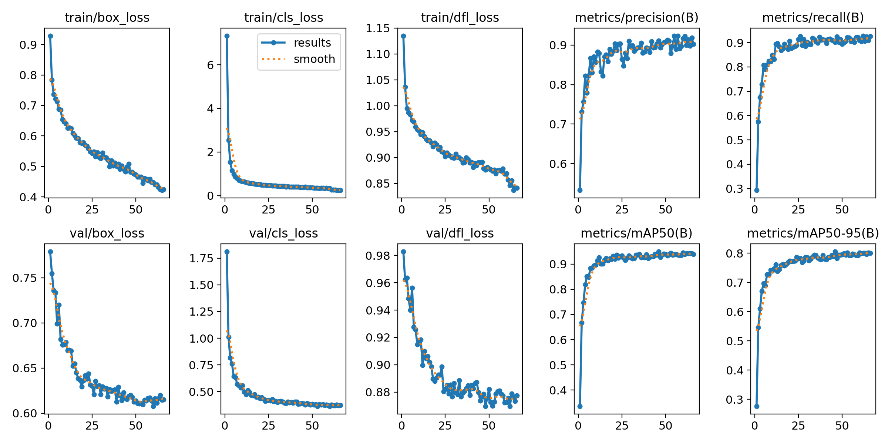
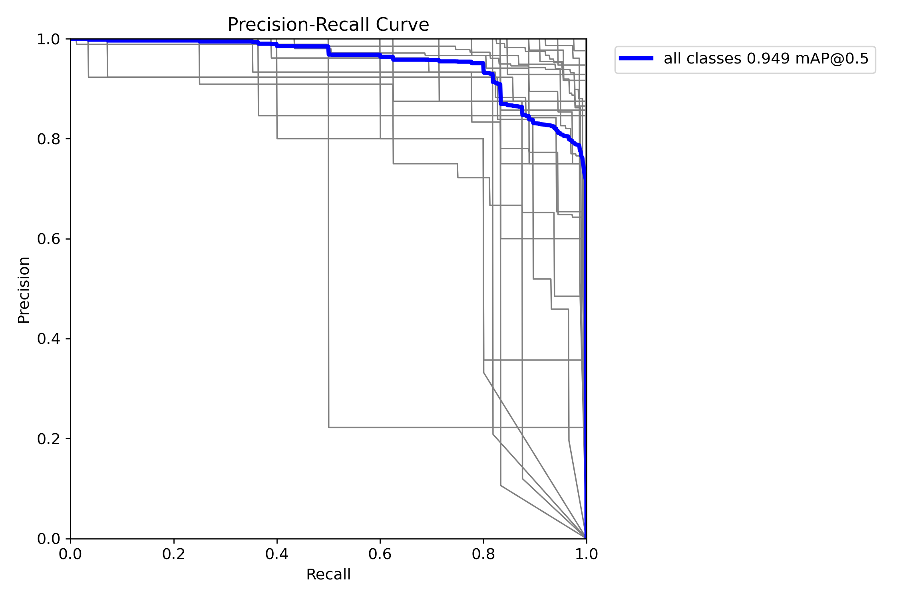
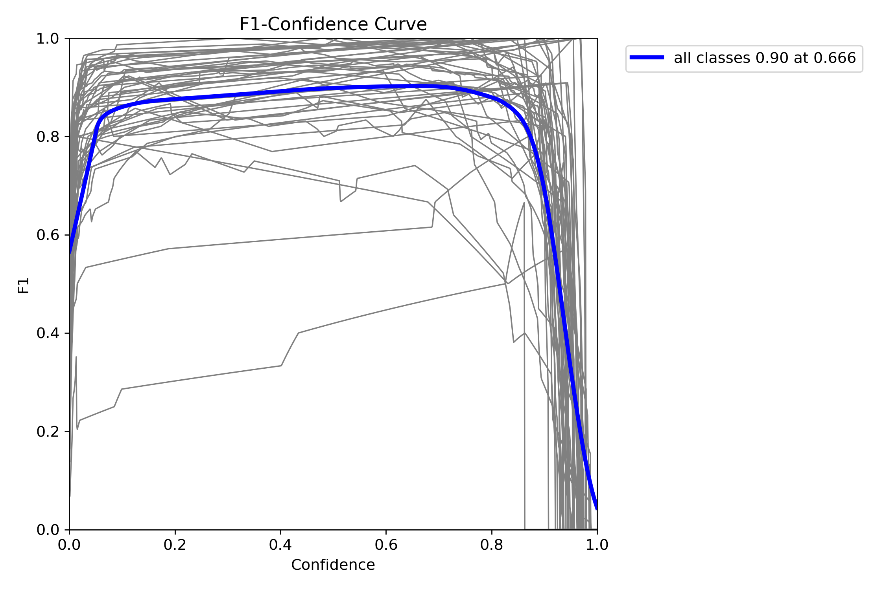
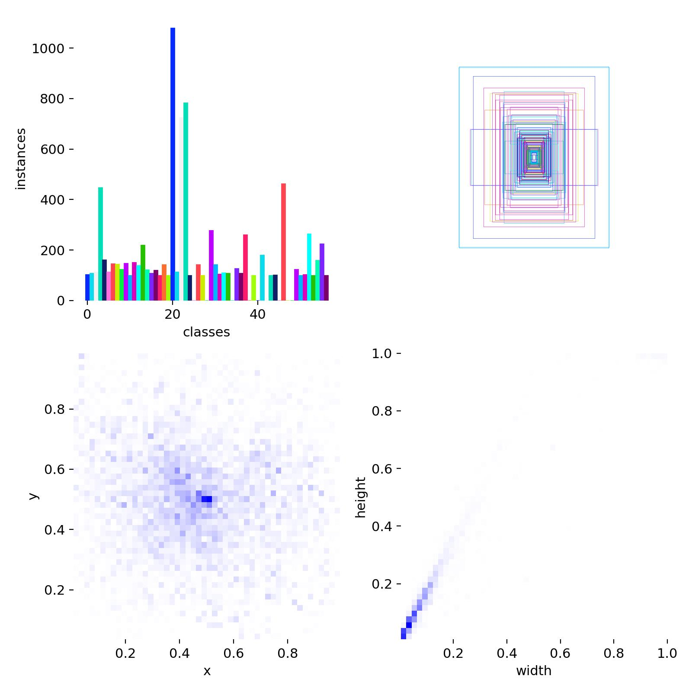
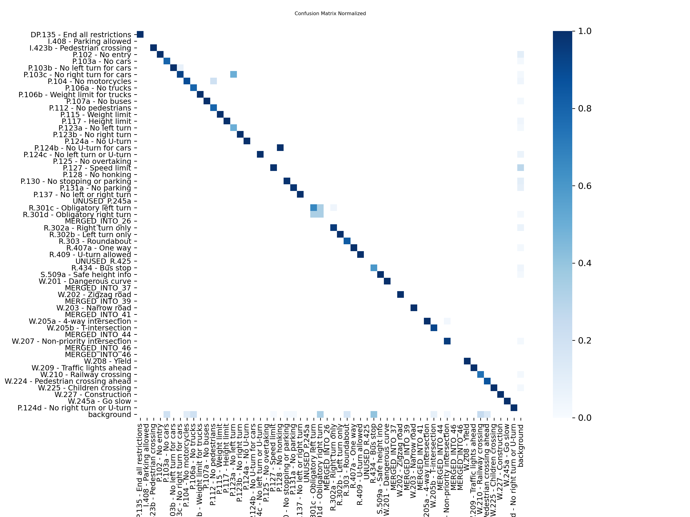
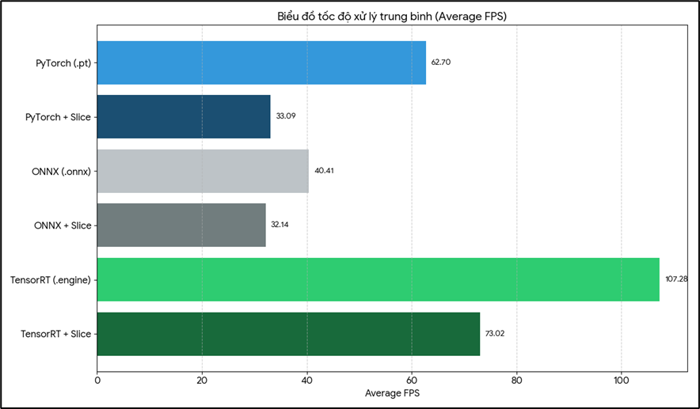
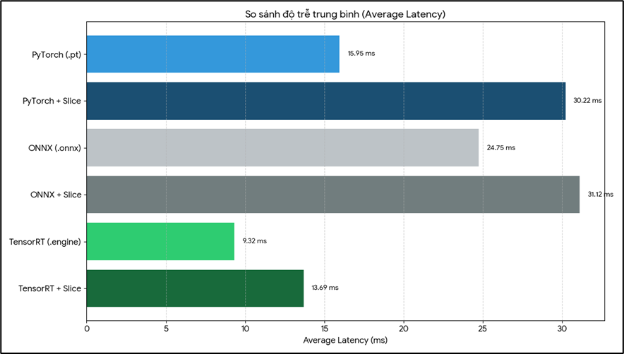

# 🚦 Real-Time Traffic Sign & Obstacle Detection (Vietnam)

This repository contains a study on real-time computer vision methods for detecting Vietnamese traffic signs and road obstacles (pedestrians and vehicles). The project evaluates the practical integration of **YOLOv11**, **TensorRT optimization**, and **Slicing-Aided Hyper Inference (SAHI)** to balance detection accuracy and throughput on high-resolution video feeds.

## 🎥 Model Demo

The following recording demonstrates real-time inference using a TensorRT engine combined with frame slicing:

<video src="https://github.com/user-attachments/assets/1b5bd2f7-7716-4e2a-9495-03789f79b4cf" controls="controls" style="max-width: 100%;">
</video>

## 🔬 Key Technical Implementations

* **TensorRT Compilation:** Models are compiled into optimized `.engine` formats to reduce latency and maximize execution efficiency on NVIDIA GPUs.
* **Slicing-Aided Hyper Inference (SAHI):** Integrates sliced-frame logic that divides input frames into smaller patches (e.g., 640x640) before running inference, improving recall on small or distant traffic signs.
* **Dual-Model Inference Pipeline:** Combines a custom-trained traffic sign detector (YOLOv11s) with a general obstacle detector (YOLOv8n) into a sequential pipeline.
* **Interleaved Slicing:** Runs sliced inference periodically (every $N$ frames) while falling back to standard full-frame resize inference on other frames to maintain acceptable processing speeds.
* **Prediction Stabilization:** Employs a simple voting and confidence decay algorithm (`PredictionStabilizer`) across tracked detections to mitigate bounding box label flickering.
* **Threaded Frame Buffering:** Utilizes separate thread workers for video frame reading and output file writing to isolate I/O latency from the core model execution.

## 💻 Tech Stack & Dependencies

This system utilizes a highly optimized stack combining state-of-the-art computer vision models, hardware-accelerated inference engines, and robust real-time image processing libraries.

| Component / Library | Version | Purpose & Integration |
| :--- | :--- | :--- |
| **[Python](https://www.python.org/)** | `>=3.8` | Primary programming language used to build the pipeline, model runner, stabilization voting logic, and dataset utilities. |
| **[Ultralytics YOLO](https://github.com/ultralytics/ultralytics)** | `>=8.3.0` | Core Object Detection framework. Powers the YOLOv11s Custom Traffic Sign model and YOLOv8n Obstacle/Pedestrian model. |
| **[NVIDIA TensorRT](https://developer.nvidia.com/tensorrt)** | `>=10.0.0` | High-performance deep learning inference optimizer. Converts `.pt` weights to `.engine` for low-latency GPU execution. |
| **[SAHI](https://github.com/obss/sahi)** | *Concept / Methodology* | **Slicing Aided Hyper Inference**. Slices high-resolution frames into smaller patches, runs inference on each patch, and merges the results to significantly boost detection accuracy on small/far-away objects. *Note: In practice, this project leverages Supervision's `sv.InferenceSlicer` implementation for better integration and compatibility.* |
| **[Roboflow Supervision](https://github.com/roboflow/supervision)** | `>=0.24.0` | Advanced CV utilities. Powers the **SAHI-style InferenceSlicer** for high-resolution cropping, and **ByteTrack** for temporal object tracking. |
| **[PyTorch](https://pytorch.org/)** | `>=2.5.1` | Base Deep Learning framework for tensor math and GPU execution. Compiled with CUDA 12.8 / CUDA 12.4 support. |
| **[OpenCV Python](https://opencv.org/)** | `>=4.10.0` | Real-time video I/O, multi-threaded capture/writing stream control, and visualization overlays/HUD rendering. |
| **[ONNX & ONNX Runtime](https://onnx.ai/)** | `>=1.17.0` | Intermediate serialization format for converting PyTorch `.pt` models to optimized TensorRT engines (`ONNXRuntime-GPU`). |
| **[NumPy](https://numpy.org/)** | `>=1.24.0` | High-performance array operations for Prediction Label Voting (PredictionStabilizer) and bounding box math. |
| **[Vast.ai](https://vast.ai/)** | *Cloud Platform* | On-demand GPU rental service used for multi-GPU training execution (2x RTX 4090 via DDP). |

## 📊 Model Training & Evaluation

The custom traffic sign core was trained on a multi-device cloud GPU setup using **Automatic Mixed Precision (AMP)** to optimize memory layout and speed. Because the system utilizes **SAHI-style slicing**, the model was explicitly trained at a high native resolution to maintain feature crispness on cropped tiles.

### ⏱️ Training Profile
* **Hardware Setup:** 2x NVIDIA GeForce RTX 4090 (24GB VRAM each), running via PyTorch Distributed Data Parallel (DDP).
* **Native Input Size:** `1280x1280` pixels (Crucial for retaining clear text/symbols on distant signs).
* **Optimization Engine:** AdamW (`lr0=0.000164`, `momentum=0.9`, `weight_decay=0.0005`).
* **Early Stopping:** Triggered at Epoch 71 (Best weights captured at Epoch 51). Total runtime: `~46.4 minutes` (0.773 hours).

### 🧠 Training Methodology & Data Augmentation

For this project, the goal was not just to achieve high validation metrics, but to train a model robust enough to handle the physical realities of standard dashcam footage. To achieve this, we bypassed the default YOLO augmentation pipeline and injected a custom `Albumentations` sequence designed specifically around environmental and hardware constraints.

#### Custom Augmentation Strategy
Rather than applying heavy, random distortions, the augmentations were constrained to simulate actual optical anomalies encountered on the road:

* **Sensor & Optical Realism:** We introduced mild `Sharpen` and `RandomGamma` shifts to account for the varying lens qualities and exposure curves found in different dashcam brands.
* **Low-Light & Headlight Simulation:** Standard glare augmentations were replaced with constrained `RandomBrightnessContrast` and `GaussNoise`. This mimics the specific "sensor washout" and high-ISO noise generated when headlights illuminate retro-reflective signs against a dark background.
* **Motion & Compression Artifacts:** `MotionBlur` and `ImageCompression` (simulating MP4 blocking) were added to train the network on the smeared or pixelated frames that occur when a vehicle is moving at high speeds.
* **Visibility Thresholds:** To reduce false positives on "ghost" objects, bounding box visibility was strictly clamped. If an augmentation cuts off or occludes more than 65% of a sign, the label is dropped from that training step.

#### Core Hyperparameters
The model was trained over 80 epochs using a high-resolution input to ensure tiny, distant features were preserved before reaching the convolution layers. 

| Parameter | Value | Rationale |
| :--- | :--- | :--- |
| **Input Size** | `1280x1280` | Essential for retaining the pixel density of distant signs (e.g., 40+ meters away). |
| **Batch Size & Hardware** | `48` | Distributed across 2x GPUs with mixed precision (`amp=True`) to maintain stable memory layouts. |
| **Scale & Translate** | `0.8`, `0.15` | Encourages the model to learn signs that are either heavily zoomed out or partially cut off at the edge of the frame. |
| **Copy-Paste** | `0.3` | Artificially increases the density of small sign instances within standard training frames. |
| **Flip (Left/Right)** | `0.0` | **Disabled.** Traffic signs are strictly directional; flipping a "Turn Right" sign destroys its contextual meaning. |
| **Color Jitter (HSV)** | *Mild* | Kept intentionally low (`hsv_h=0.015`) to respect the standardized, retro-reflective paint colors used on physical road signs. |
| **Mosaic / Close Mosaic** | `1.0` / `20` | Mosaic augmentation was utilized heavily but disabled for the final 20 epochs to allow the model to fine-tune on natural, undistorted image layouts. |
---

### 📈 Loss Curves & Validation Metrics

#### 1. Global Performance Metrics (All 57 Classes Combined)

| Metric | Score Index | Description |
| :--- | :--- | :--- |
| **mAP@0.5** | **0.937** | Mean Average Precision evaluated at an IoU threshold of 0.5. |
| **mAP@0.5-95** | **0.795** | Stringent mean precision evaluated across multi-step IoU bounds (0.5 to 0.95). |
| **Precision (Box)** | **0.892** | Accuracy of bounding box classification matching. |
| **Recall (Box)**| **0.886** | Ratio of true traffic target structures successfully captured. |
| **Peak F1-Score** | **0.90** | Balanced performance reached at a structural confidence threshold of `0.666`. |

#### 2. Convergence Curves
Training logs show standard gradient descent. Bounding box (`box_loss`), classification (`cls_loss`), and Distribution Focal Loss (`dfl_loss`) exhibit stable convergence with minimal signs of over-fitting:



#### 3. Precision-Recall Matrix Relationships

| PR Curve | F1-Confidence Curve | Bounding Box Targets |
| :---: | :---: | :---: |
|  |  |  |

</details>

---

### Class-by-Class Validation Performance

The dataset contains a highly diverse distribution across **57 unique class definitions** mapped directly to the official Vietnamese Road Traffic Signs standard. 

Below is the validated accuracy profile extracted upon training completion:

| Class ID / Code | Traffic Sign Description | mAP@0.5 | mAP@0.5-95 |
| :--- | :--- | :---: | :---: |
| **P.127** | Speed limit (Biển hạn chế tốc độ tối đa) | `0.947` | `0.807` |
| **P.130** | No stopping or parking (Cấm dừng và đỗ xe) | `0.988` | `0.838` |
| **P.131a** | No parking (Biển cấm đỗ xe) | `0.971` | `0.843` |
| **W.207** | Non-priority intersection (Giao nhau với đường không ưu tiên) | `0.978` | `0.816` |
| **W.224** | Pedestrian crossing ahead (Đường người đi bộ cắt ngang) | `0.989` | `0.831` |
| **W.245a** | Go slow (Đi chậm) | `0.991` | `0.823` |
| **P.102** | No entry (Biển cấm đi ngược chiều) | `0.935` | `0.707` |
| **W.201** | Dangerous curve (Chỗ ngoặt nguy hiểm) | `0.994` | `0.804` |
| **P.103b** | No left turn for cars (Cấm ô tô rẽ trái) | `0.987` | `0.923` |
| **P.103c** | No right turn for cars (Cấm ô tô rẽ phải) | `0.992` | `0.901` |
| **I.423b** | Pedestrian crossing (Vị trí người đi bộ sang đường) | `0.995` | `0.866` |
| **R.302a** | Right turn only (Các xe chỉ được rẽ phải) | `0.959` | `0.779` |

#### Confusion Matrix



#### ⚡ Raw Engine Latency Profile (Prior to TensorRT Optimization)
* **Preprocess:** 0.1ms per image
* **PyTorch Inference (FP32 base):** 1.8ms per image *(~555 FPS equivalent on native hardware matrix)*
* **Postprocess:** 0.9ms per image
</details>

## 🚀 Optimization & Inference Benchmarks

To meet real-time deployment demands on high-resolution streams (`1280x1280`), the baseline PyTorch model was exported and optimized through **ONNX** and **NVIDIA TensorRT** pipelines. 

### ⏱️ Performance Breakdown
All benchmarks were executed sequentially on an **NVIDIA RTX 4090** to measure processing throughput (FPS) and end-to-end hardware execution latency.

| Model Format | Slicing (SAHI) | Resolution | Avg Latency | Std Dev | Avg FPS | Min Latency | Max Latency | Relative Perf. |
| :--- | :---: | :---: | :---: | :---: | :---: | :---: | :---: | :---: |
| **PyTorch (`.pt`)** | ❌ | $1280 \times 1280$ | 15.95 ms | 2.31 ms | **62.70** | 13.52 ms | 66.09 ms | 100.0% (Base) |
| **PyTorch + Slice** |  | $1280 \times 1280$ | 30.22 ms | 30.35 ms | **33.09** | 12.68 ms | 567.51 ms | 52.8% |
| **ONNX (`.onnx`)** | ❌ | $1280 \times 1280$ | 24.75 ms | 2.25 ms | **40.41** | 21.79 ms | 57.65 ms | 64.5% |
| **ONNX + Slice** |  | $1280 \times 1280$ | 31.12 ms | 14.12 ms | **32.14** | 23.79 ms | 614.92 ms | 51.3% |
| **TensorRT (`.engine`)**| ❌ | $1280 \times 1280$ | **9.32 ms** | **1.03 ms** | **107.28** | 7.00 ms | 25.94 ms | **171.1%** |
| **TensorRT + Slice** |  | $1280 \times 1280$ | **13.69 ms** | **6.60 ms** | **73.02** | 7.44 ms | 397.82 ms | **116.5%** |

### 📈 Metrics Visualization

| Processing Throughput (Higher is Better) | End-to-End Latency Profile (Lower is Better) |
| :---: | :---: |
|  |  |

### 🔑 Key Engineering Takeaways

* **The TensorRT Advantage:** Compiling the network to a native `.engine` format yields a **1.71× performance uplift** over baseline PyTorch, hitting a massive **107.28 FPS**. This is achieved via architectural layer fusion and hardware-specific kernel selections optimized directly for NVIDIA's execution cores.
* **Overcoming the Slicing Bottleneck:** Tiling/Slicing high-resolution inputs usually tanks system frame rates due to multiple sub-patch inference passes. However, by offloading the pipeline onto TensorRT, **TensorRT + Slice runs at 73.02 FPS**—effectively outperforming a standard PyTorch model running *without* any slicing at all (62.70 FPS).
* **Deterministic Low Latency:** Standard TensorRT execution brings average latency down to a near-instantaneous **9.32 ms** with a tight standard deviation of just **1.03 ms**, ensuring highly predictable frame timing and avoiding jerky video rendering.
* **VRAM Efficiency:** Beyond sheer computation speed, the compiled engine bypasses heavy runtime overhead frameworks, stripping out unnecessary graph processes to keep the GPU operating cooler and substantially decreasing the memory footprint during long deployment cycles.

## 🛠️ Installation

### Prerequisites

* **GPU:** NVIDIA RTX 30/40 Series recommended (Tested on RTX 4050 & 3060).
* **Drivers:** CUDA 11.8 or 12.x installed.
* **Python:** 3.8+.

### Setup

1. **Clone the repository:**

    ```bash
    git clone https://github.com/abcdef54/Traffic-Sign-Detection.git
    cd Traffic-Sign-Detection
    ```

2. **Install dependencies:**

    ```bash
    pip install -r requirements.txt
    ```

    *(Ensure you have `ultralytics`, `supervision`, `opencv-python`, and `numpy`)*.

3. **Prepare Models:**
    * Place your trained Sign model (`.engine` or `.pt` or `.onnx`) in `models/signs/`.
    * (Optional) Place a standard YOLOv8n model in `models/peds/` for pedestrian detection.

## 📂 Project Structure

```text
Traffic-Sign-Detection/
│
├── datasets/                   # Training Data
│   └── VietNamSigns/           # Vietnamese Traffic Sign Dataset
│       ├── data.yaml
│       ├── train/
│       └── val/
│
├── models/                     # Model Weights
│   ├── pedestrians/            # YOLOv8n (COCO) for obstacles
│   └── signs/                  # YOLOv11s (Custom) for signs
│       └── best.engine         # TensorRT Optimized Weight
│
├── src/                        # Core Logic Modules
│   ├── __init__.py
│   ├── model.py                # TensorRTSliceModel (Slicing & Dual-Core Logic)
│   ├── video_reader.py         # Multithreaded Video Capture
│   ├── voting.py               # PredictionStabilizer (Label Smoothing)
│   └── distance.py             # (Placeholder) Distance Estimation
│
├── runs/                       # Training/Inference Outputs
│
├── main.py                     # Main script for running inference
├── requirements.txt            # Python Dependencies
└── README.md                   # Project Documentation

```

## 🚀 Execution & Usage

There are two ways to set up and run this project:

### Option A: Local Python Environment (Recommended & Quicker)
This is the fastest way to get started and run the inference loop with live visualization.

1. **Create and activate a virtual environment (Python 3.10 recommended):**
   ```bash
   python -m venv .venv
   # On Windows:
   .venv\Scripts\activate
   # On Linux/macOS:
   source .venv/bin/activate
   ```
2. **Install the dependencies:**
   ```bash
   pip install -r requirements.txt
   ```
3. **Run inference directly:**
   ```bash
   python main.py --show
   ```

---

### Option B: Containerized Execution (Docker)
You can run the project containerized using the provided `run_windows.bat` or `run_linux_mac.sh` scripts.

> [!WARNING]
> **Not recommended for quick testing.**
> The Docker container is built on top of NVIDIA's full PyTorch development image. Consequently:
> * The build phase takes **~1 hour** to complete.
> * The final image size is **~50 GB**.
> * Showing the live window (`--show`) from inside Docker on Windows requires running an XServer utility (like VcXsrv) on the host machine.

To run via Docker:
* **Windows:** Run `.\run_windows.bat`
* **Linux/macOS:** Run `./run_linux_mac.sh`

---

### 💻 Running Inference Examples

Once your environment is set up (locally or via Docker), you can run inference using the following configurations:

#### 1. Webcam Stream Inference (Signs Only)
Run inference on your default webcam stream (ID `0`). Slicing is enabled by default.

```bash
python main.py --input 0 --model models/signs/best_dynamic.engine --show
```

### 2. Video File Processing (Signs + Obstacles)
Run the dual-model pipeline on a video file and save the annotated result.

```bash
python main.py \
  --input videos/dashcam_footage.mp4 \
  --output results/output.mp4 \
  --model models/signs/best_dynamic.engine \
  --ped-model models/peds/yolov8n.engine \
  --save \
  --verbose
```

### 3. Standard Resize Inference (No Slicing)
Disable sliced-frame logic to benchmark standard full-frame inference speeds (note: small or distant traffic signs may have lower detection rates).

```bash
python main.py --model models/signs/best_dynamic.engine --no-slice --show --input "0"
```

## ⚙️ Configuration Parameters

Command-line parameters can be configured to adjust the performance and thresholds of the pipeline:

| Argument | Default | Description |
| --- | --- | --- |
| `--input` | `"0"` | Path to video file or webcam device ID (`0`, `1`). |
| `--model` | *Required* | Path to the custom traffic sign detector weights (`.pt` or `.engine`). |
| `--ped-model` | `""` | Path to general obstacle detector weights. If omitted, the dual-model pipeline is disabled. |
| `--no-slice` | `False` | Disables SAHI-style frame slicing (forces standard full-frame inference). |
| `--slice-interval` | `5` | Specifies frame interval `N` for sliced inference to manage throughput. |
| `--conf-detect` | `0.2` | Confidence threshold for object detection. |
| `--conf-track` | `0.55` | Tracking confidence threshold for maintaining detections. |
| `--verbose` | `False` | Enables printing detailed performance statistics to the console. |


## 📚 References & Credits

* **Dataset:** [VNTS Merge Vietnamese Traffic Sign Dataset](https://universe.roboflow.com/nl-gt2le/vnts-merge) on Roboflow (hosted by the Roboflow Universe community).
* **Inference & Architecture:**
  * **YOLOv11 & YOLOv8:** Built by [Ultralytics](https://github.com/ultralytics/ultralytics).
  * **ByteTrack:** Tracking algorithm used for temporal consistency, integrated via Supervision.
* **Software Tools:**
  * **Supervision:** Provided by [Roboflow](https://github.com/roboflow/supervision) for frame-slicing and visual annotations.
  * **TensorRT:** Built by [NVIDIA](https://developer.nvidia.com/tensorrt) for hardware-optimized execution.
